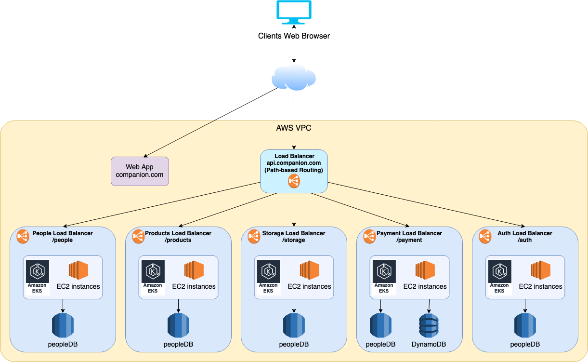

# Java Microservice Example

This repository aims to be a guideline to build microservices with Java trying to follow the best practices that I have 
learned through the years working on this area, with that in mind I cannot say this is the ultimate guide and any 
comments or suggestions will be greatly appreciated.

In this framework you will find ready to use features that are useful and in some cases mandatory for production 
applications. You will also find examples of how a microservice should be design, how should be tested, some examples 
of procedures that are needed working in a backend team like pull requests, the handling of the different environments 
such as local, stage and prod. Some guidance on CI, CD and some other things.

The idea with this project is to help people get more quickly to a production ready product and also to help people that 
are starting as backend developers or people who intent to start an startup or already have a company to understand how 
to get value of a good designed backend infrastructure, for some this may be a place to learn one or two things they can improve in their their current 
systems, for others this may be what they are used to see in a daily basis and some others won't agree with what I expose here. 
In order to improve the quality of this framework I am open to hear any comment or suggestions :)

# The project

For this example we will be working as an example company called "Companion" with a domain companion.com. This company 
sells amazing T-Shirts, they have a web page under companion.com where they publish all the T-Shirts that are available 
for sale and allows customers to buy directly in the webpage. This company have 4 main projects:

- Store - Web app with React - under `companion.com`
- Company Portal - Web app with React - under `portal.companion.com`
- Companion App - Native app with Flutter - Available in `iOS` and `android`
- Backend Services - With Java - under `api.companion.com`

Note: This is an oversimplified example that aims to show a good microservice structure, apart from the Backend Services
the 3 projects previously mentioned does not exist and are described only to give context to this example, 
you will see diagrams and requirements for these projects ass well to understand the requirements of the Backend Services, 
in this repo we will only see Java code and microservices projects.

Note: All Companion's products are designed for use with AWS for this example

## Project Requirements

To get a more general idea this is the high level project architecture of the company here's is a high level diagram of 
the projects interactions:

Next I will describe some features of each projects along with some requirements, the features are there to give a 
bigger context of what each project does and how big it is. The requirements are the ones that are implemented in this 
repository as part of the backend team to show some good practices and procedures.

### Store and Mobile App

The Store and the Mobile App are client faced projects and both allow users to browse products, buy products, create an account 
and look at previous purchases, save their favorites products, gift products to other people, publish and buy from 
products from a marketplace and have a virtual wallet that can be used to buy more products in the store or the marketplace. 
And many many more features that will not be listed.

#### Requirements

- Login with email and password, social media
- Register
- Get featured products
- Get product details by ID
- Add credit card
- Buy products selecting payment method and delivery address
- Get purchase history
- Get Store location to show on map

### Company Portal

The company portal is used for many things internally, since adding new products, updating product information, 
removing listed products, update available products in each storage, see reports and KPIs

#### Requirements

# Backend

All the microservices exposes rest endpoints

## Setup

## Logging

Logging is a vital part of evey production architecture since it is sometimes our only way to understand what is 
happening on a daily basis in our systems. It is also not secret that the bigger and complex the system the harder it 
is to debug it and give it support but that can be easily alleviated with a good logging system. Though not many people 
appreciate the potential of the logs, in my experience people tend to focus more on quickly developing new features, 
or getting to the market as soon as possible or maybe be creative and innovate with new technologies to create 
some amazing world changing app, leaving logs for later as a tech debt which is lately forgotten, in some cases 
people later implements logs systems just to comply with the tech debt and start adding logs in the flow of some main 
features but not real value is being extracted from the logs and its implementation in these cases are more than 
all useless, finally, in some cases the logs that were not implemented at the start are implemented as a tech debt later 
and it works amazingly and its good implemented but this last case ist not seen very often. I have seen many projects 
in different companies that either had a terrible logging design or not logging at all, there were only a couple of 
projects with an amazing logging system and coincidentally those companies were the biggest and more successful 
companies that I have had the privilege to work with. 

Logs provide useful information for the company, the not only help debug production issues and help track down problems, 
they also add value to a company by giving valuable data of its services, information that helps the company to learn 
of its products and designs and serves as a tool for continue development, to improve the current designs, to make them 
more efficient! or more secure, or be able to expand a business to new regions and geolocations. From the business 
point of view a company should be always changing and improving itself, growing, innovating, and for all that people 
need data to take decisions with a good designed logs we will be able to extract useful information of our systems, 
like getting latency statistics of each service, understand how your microservices works, 
what endpoints get called the most? which is the slowest system and why? what clients call us the most? what countries? 
how much error do we have in our systems? how do those categorize? where should we put efforts to fix or improve and 
where we shouldn't? all these questions can be answerable analyzing the information stored in the logs, for this there 
are many softwares in the market, software that automatically logs the calls made and track what a user does on a app, 
what buttons or endpoints the user calls and they give you a lot of useful information and for backend we can also 
use third party software to do this job. 

I rather build my own system that I share here, so it can be easily modified to include 
information important for you. Lets say that a new company has backend with 2 microservices A and B, A has 10 rest 
endpoints and B has 20. Each morning the servers has an increase in users and its EC2 instances go from A having 2 to 5 
and B having 2 to 6. We want to reduce costs, we then log each call received and we log what endpoint is being called, 
from which microservice, the status code of the response, the time taken to respond in milliseconds the requesting IP. 
With this information we are able to analyze the logs and realize that from all the calls made to A, 45% belong to a 
couple of endpoints, we also find out that 5 endpoints of B start increasing its response time from 100ms to 1500ms. 
With this information we can make some decisions, like we can create a new microservice that only has the 2 endpoints of A 
called C, now A has 8 endpoints, B 20 and C has 2; we can also investigate on the reason why the 5 endpoints of B get 
degraded under heavy load and we find out that those 5 endpoints are calling an external system that cannot handle the 
load but luckily that information does not change very often, more like one time each week so we decided to cache the 
response one time in a cache system, maybe in DB or a solution like redis and implement a notification endpoint which 
receives the new data when it changes and update the cache with the new information so all instances can get the latest 
information. With these changes is possible to imagine that each morning under load the instances will grow from 
A having 1 to 2, B having 2 to 4 and C having 1 to 2. This is an example of how a good use of the logs can help to 
improve a system.

/// Correct bellow here

Check seven design principles for security in the cloud -> Enable real-time traceability

we can get logs from other products like a load balancer or a web server but I rather the network logging to be a 
responsibility of our application, so we only need one place to configure and avoid having to configure extra products 
to work as expected 

or be able to shoot alarms based on events

Logging plays an essential rol in the support process, they help to track down production issues to the root cause, 
help resolve bugs in an efficient manner and point out possible errors even before they happen. 

Dont forget to mention the choose in logger framework, markers and MDC http://logging.apache.org/log4j/2.x/manual/async.html
Remember to mention the need to the env variable to async logs

## Interceptors 

## Database

DynamoDB, MariaDB

## Rest endpoints

DTO vs models, converters

## Calls to other Systems

Retrofit 2

## Tests and coverage

## Pul Requests (PR), approvals and rejections

## CI - CD

SonarQ, Snyk

## Queues

## Circuit breaker

## Performance
